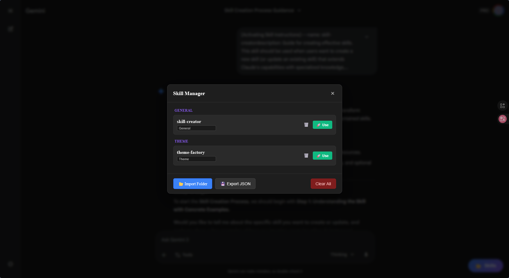

# 🚀 Gemini Skill Support (Gemini Skill Hub)

**The missing Skill Manager for Google Gemini.**  
Organize, categorize, and inject thousands of Claude/ChatGPT prompts directly into the [Google Gemini](https://gemini.google.com) Web UI.  
**100% Free • Local-Only • No API Keys Required**

 
*(Add a screenshot of your beautiful modal here!)*

## ✨ Features
- **📂 Bulk Import:** Import entire folders of `SKILL.md` files (compatible with Claude projects).
- **🗂️ Categorization:** Group skills by category (Code, Writing, Biology, etc.) with a simple dropdown.
- **⚡ One-Click Use:** Instantly inject complex instructions into Gemini's prompt box.
- **🔒 Privacy First:** Your skills are stored locally in your browser. Nothing is sent to us.
- **💾 Auto-Backup:** Export your entire registry to JSON anytime.

## 🚀 Why use this over "Gems"?
| Feature | Google Gems | Gemini Skill Support |
| :--- | :--- | :--- |
| **Cost** | Free / Advanced | **Free Forever** |
| **Storage** | Cloud (Google) | **Local (Your Device)** |
| **Portability** | Locked to Google | **Exportable JSON / Markdown** |
| **Editing** | Web UI only | **Edit files in VS Code / Notepad** |
| **Organization**| Flat List | **Custom Categories** |

## 📦 Installation

### Chrome / Edge / Brave
1. Download the ZIP.
2. Go to `chrome://extensions`.
3. Enable **Developer Mode** (top right).
4. Drag and drop the `gemini_skill_sync_chrome` folder.
5. Refresh your Gemini website.
### Firefox
1. Download the XPI file from right.
2. Go to `about:debugging`.
3. Click **This Firefox**.
4. Click **Load Temporary Add-on**.
5. Select `gemini_skill_sync_firefox/gemini_skill_sync_firefox-1.0.xpi`.
6. Refresh your Gemini website.

## 🛠️ Usage
1. Open [gemini.google.com](https://gemini.google.com).
2. Look for the floating **"📂 Skills"** button in the bottom-right.
3. Click **"Import Folder"** and select your directory of skills.
4. Click **"🚀 Use"** on any skill to activate it!

## 🤝 Contributing
Capabilities are endless! Feel free to open a PR to add:
- [ ] Drag-and-drop reordering
- [ ] Cloud sync (optional)
- [ ] Keyboard shortcuts

## 📜 License
MIT License. Free to use and modify.
